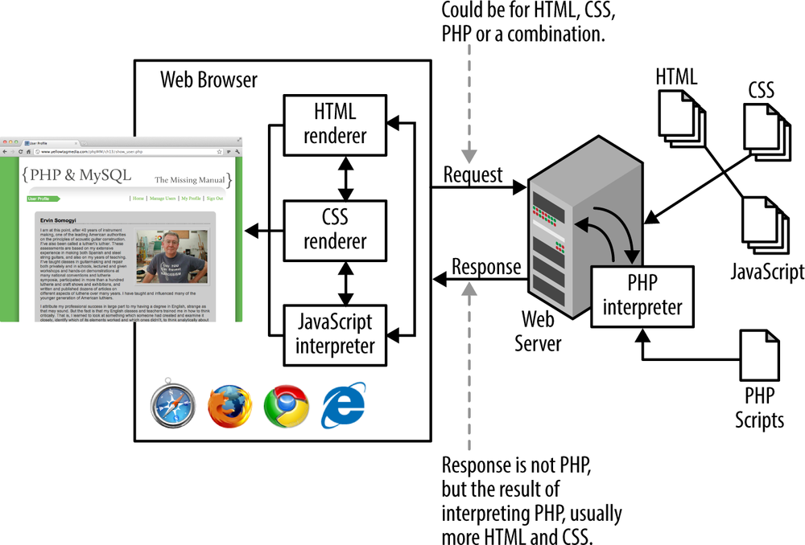
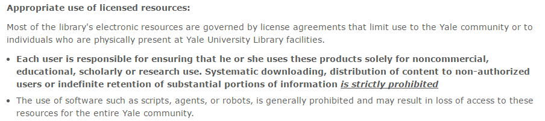
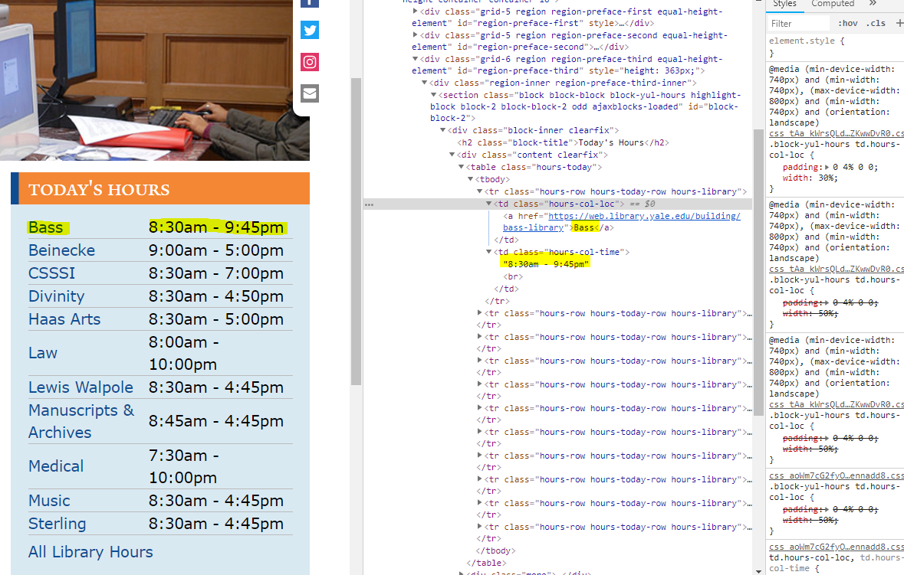

Web Scraping with PYTHON
======
This workshop is licensed under a [Creative Commons Attribution 4.0 International License](https://creativecommons.org/licenses/by/4.0/).  

View online: [https://git.yale.edu/pages/yul-dss/WebScrapingPython/](https://git.yale.edu/pages/yul-dss/WebScrapingPython/)

Download workshop materials: [https://yale.box.com/v/WebScrapingPython](https://yale.box.com/v/WebScrapingPython)


## OUTLINE:
1. What is web-scraping? What can be scraped?
2. Tools for Scraping
3. Making a GET Request
4. Scraping an HTML Table
5. Scraping links on a page
6. Downloading Files 
7. Scrap all text
6. Scraping Paginated Results
7. Resources

## What is Web Scraping?
* Fetching and extracting data from websites using software or bots. 
* Useful when there is no API for fetching data
* No direct 'Download' of data
* Data trapped on older websites

## What sites can be scraped?
* Any website can be scraped
* Basic:
  1. Simple HTML pages
  2. Textual data, HTML tables, hyperlinks
* Advanced:
  1. Javascript/AJAX
  2. Password protected
  3. Unstructured Data
  4. Interactive/visualizations

## What are we scraping?
* The HTML behind every web page
* [right-click] "View Source"
* Will not interperet content like a browser



### Copyright & Fair Use
* Check the site for license
> As per Clause 8, dealing with Restrictions on Content and Use of the Services, of the Twitter Terms of Service, as part of your free access, you are expressly prohibited to access, tamper with, or use non-public areas of the Twitter services; or probe, scan, or test the vulnerability of any system or network or breach or circumvent any security or authentication measures; or access or search or attempt to access or search the Services by any means (automated or otherwise) like scraping without the prior consent of Twitter.
* Ask the site owner
* Check withthe Licensing & Copyright Librarian (Joan Emmet)
* Electronic Resources @ Yale:


See [Resources for Text & Data Mining](http://guides.library.yale.edu/c.php?g=547554&p=3757053 "Resources for text & Data Mining")

### ROBOTS.TXT
* Check the ROBOTS.TXT file
* This files gives you an idea of which areas of the site you are 'Allowed' and 'Disallowed' to scrape
* How do I find this file?
  * 'baseURL' + '/robots.txt'
  * web.library.yale.edu/robots.txt
* [More info on robots.txt](http://www.robotstxt.org/robotstxt.html)

### Tools for Web Scraping
* Python:
  * BeautifulSoup --> Modifying, Parsing, and Searching HTML or XML
  * Selenium --> Testing websites; useful for scraping sites with lots of js, interactivity, or log-ins
* Scrapinghub --> create spiders to crawl the web; Scrapy Cloud runs in browser & includes GUI
* OctoParser --> Point & Click web scraping
* OpenRefine
* R
* Excel --> NodeXL

## Making a GET Request
* We access the HTML of any website by making a GET request for that site. 
* Generally you can copy & paste the full URL from your browser directly into your python code. 
* First we save the results of our GET request to the variable r, before printing those results to the screen.


```python
import requests

url = "http://web.library.yale.edu"
r = requests.get(url)
print(r)
```

    <Response [200]>
    
### HTML Status Codes
A `<Respose [200]>` means we succesfully connected to the webpage. Read more about HTML status codes here: [Status Codes](https://en.wikipedia.org/wiki/List_of_HTTP_status_codes)

### GETting the HTML
In the last section we got a succesful response from our GET request. Now let's get the actual HTML text for the webpage.

```python
import requests

url = "http://web.library.yale.edu"
r = requests.get(url)
print(r.text)
```

*  We use `r.text` to access the 'text' or HTML behind the webpage. 
*  We've successfully scraped our first webpage

## Scraping an HTML Table
* We'll be scraping the Yale University Library homepage for a list of libraries and their hours of operation. 
* If you open the library site, you can see a small table with the names of library locations and their hours for today.


### 'Inspect'

* When inspecting the HTML code behind the *table* element, we see that each library location name is stored in a *td* element with the *class="hours-col-loc"*
* The hours of operation are stored in the *td* element directly following the location 
* Now that we've identified where the data we want to scrape lives on the page, we can begin to write our code.

### Importing Modules
* The first step in any python code is identifying which libraries we are using and importing those. For this section, we will be using three python libraries: csv, BeautifulSoup, requests.

```python
import requests, csv
from bs4 import BeautifulSoup
```

### Making the soup
* The python library BeautifulSoup allows us to parse our website's HTML before filtering or searching through the results. 
* Our code: 
  * Loads the variable r into BeautifulSoup  
  * Identifies 'html.parser' as the method for parsing the site's HTML. 
  * When we print the variable soup, we see the site's raw HTML, the same HTML that we see when we 'View Source' through the browser. 


```python
url = "http://web.library.yale.edu"
r = requests.get(url)
# print(r.text)

soup = BeautifulSoup(r.text, 'html.parser')
print(soup)
# print(soup.prettify())
```
```html
    <!DOCTYPE html>
    
    <!--[if lt IE 7 ]> <html lang="en" dir="ltr" class="ie6"> <![endif]-->
    <!--[if IE 7 ]>    <html lang="en" dir="ltr" class="ie7"> <![endif]-->
    <!--[if IE 8 ]>    <html lang="en" dir="ltr" class="ie8"> <![endif]-->
    <!--[if IE 9 ]>    <html lang="en" dir="ltr" class="ie9"> <![endif]-->
    <!--[if (gt IE 9)|!(IE)]><!--> <html dir="ltr" lang="en"> <!--<![endif]-->
    <head>
    <meta content="IE=edge" http-equiv="X-UA-Compatible">
    <!--
    
      GGGGGGGGGGGG      GGGGGGGGGGG               fGGGGGG
        ;GGGGG.             GGGi                     GGGG
          CGGGG:           GGG                       GGGG
           lGGGGt         GGL                        GGGG
            .GGGGC       GG:                         GGGG
              GGGGG    .GG.        ;CGGGGGGL         GGGG          .LGGGGGGGL
               GGGGG  iGG        GGG:   ,GGGG        GGGG        tGGf     ;GGGC
                LGGGGfGG        GGGG     CGGG;       GGGG       GGGL       GGGGt
                 lGGGGL                  CGGG;       GGGG      CGGGCCCCCCCCCCCCC
                  GGGG                   GGGG,       GGGG      GGGG
                  GGGG             tCGG; CGGG,       GGGG      GGGG
                  GGGG          GGGG     CGGG.       GGGG      GGGGL
                  GGGG         GGGGC     CGGG.       GGGG      :GGGGC          :
                 ,GGGGG.       GGGGG:  .LGGGGG,.tG   GGGG        GGGGGGt,..,fGC
            ,GGGGGGGGGGGGGGf    iGGGGGG   CGGGGC  GGGGGGGGGG       LGGGGGGGC
    
      -->
    <meta content="text/html; charset=utf-8" http-equiv="Content-Type"/>
    <link href="http://web.library.yale.edu/sites/all/themes/yale_omega_base/images/favicon.ico" rel="shortcut icon" type="image/vnd.microsoft.icon"/>
    <meta content="width=device-width, initial-scale=1, maximum-scale=10, minimum-scale=1, user-scalable=yes, target-densitydpi=160dpi" name="viewport"/>
    <meta content="Get to know the helpful people, explore the unique collections, and see the amazing spaces of the Yale University Library system." name="description"/>
    <meta content="Drupal 7 (http://drupal.org)" name="generator"/>
    <link href="http://web.library.yale.edu/" rel="canonical"/>
    <link href="http://web.library.yale.edu/" rel="shortlink"/>
    <title>Yale University Library | The Heart of the University</title>
    <meta content="true" name="HandheldFriendly">
    <meta content="320" name="MobileOptimized">
    <!-- Apple Touch Homescreen images -->
 ...
    </body>
    </html>
```   
    
### Straining the Soup
* We have the HTML for the entire page, so we must filter these results to reach just the elements we want to scrape.
* As we recall, the info we wish to scrape lives in a *td* element with *class="hours-col-loc"*
* Use the `find_all` function built in to BeautifulSoup


```python
tableData = soup.find_all('td', class_="hours-col-loc")
print(tableData)
```

    [<td class="hours-col-loc">Bass</td>, <td class="hours-col-loc">Beinecke</td>, <td class="hours-col-loc">CSSSI</td>, <td class="hours-col-loc">Divinity</td>, <td class="hours-col-loc">Haas Arts</td>, <td class="hours-col-loc">Law</td>, <td class="hours-col-loc">Medical</td>, <td class="hours-col-loc">Sterling</td>]
    

* Now we have a list of HTML elements, but we want the specific text inside the HTML. 
* Before we can begin pulling out this text, we need to create a loop in our code. This loop does three things: 
  * First it selects a *td* element in our tableData list and saves it as the variable td 
  * Then the .text function pulls out only the string of text inside the *td* element (library location) and stores the value in a variable called libraryName
  * Lastly it prints the result. 
* Our loop repeats the process again for the next *td* element in our list. We should see the name of each library printed to the screen in its own line.


```python
for td in tableData:
    libraryName = td.text
    print(libraryName)
```
```
Bass
Beinecke
CSSSI
Divinity 
Haas Arts
Law 
Lewis Walpole
Manuscripts & Archives
Medical
Music
Sterling
```    

* Next we need to get the hours that each library is open. 
* This data lives in an adjacent *td* element which is referred to as a sibling. 
* BeautifulSoup allows us to move over to the neighboring element with a function called `.next_sibling`.
  * We create a variable called hours 
  * Then we set it equal to `td.next_sibling.text`. Our code will then print this variable. 
* If we run the code now, we should see a list alternating between a library's name and the hours of operation. 


```python
for td in tableData:
    libraryName = td.text
    hours = td.next_sibling.text
    print(libraryName,hours)
```

```
Bass 8:30am - 9:45pm
Beinecke 9:00am - 5:00pm
CSSSI 8:30am - 7:00pm
Divinity 8:30am - 4:50pm
Haas Arts 8:30am - 5:00pm
Law 8:00am - 10:00pm
Lewis Walpole 8:30am - 4:45pm
Manuscripts & Archives 8:45am - 4:45pm
Medical 7:30am - 10:00pm
Music 8:30am - 4:45pm
Sterling 8:30am - 4:45pm
``` 

### Exporting the Data
* Now that we have filtered our results and reached the data we want to scrape from the site, we need to export our results so they can be analyzed. 
* We can save our results to a CSV file, which can be opened in excel or any text editor. 
  * First, we open a csv document with our python script. The open command will open the file within the first set of quotes. If that file doesn't exist, python will create a file with that name. 
  * Next, we set the python function `csv.writer` to a variable `w`. This allows us to begin writing data to the CSV file. (The csv file will 'close' or 'save' at the end of the loop) 
  * Then, we must decide what to save to the CSV file

```python
with open('yaleLibraryHours.csv', 'w', newline='') as ourCSVdata:
    w = csv.writer(ourCSVdata)
    for td in tableData:
        libraryName = td.text
        hours = td.next_sibling.text
        #print(libraryName,hours)
```   

* Before we can write our data to the CSV, we should create headers for our columns: 
  * We save the value of our headers as a list. The values in this list represent one row of our final CSV file. 
  * The function writerow will write the list called headers to our CSV file. 
  * After running the code, we will notice a new file called  "yaleLibraryHours.csv" is now in the same folder as our python code. We can open the file and we will see our headers. 


```python
with open('yaleLibraryHours.csv', 'w', newline='') as ourCSVdata:
    w = csv.writer(ourCSVdata)
    # write header for the csv
    w.writerow(['Library', 'Hours'])
   
    for td in tableData:
        libraryName = td.text
        hours = td.next_sibling.text
        #print(libraryName, hours)
```

* We can now add our scraped data to our CSV file. To do this we must write a row of data during each iteration of the for loop.
  * First, we create an empty list called row. 
  * Then add our data to the list using row.append 
  * Finally, writing the list to our CSV file using the function `w.writerow(row)`. 


```python
with open('yaleLibraryHours.csv', 'w', newline='') as ourCSVdata:
    w = csv.writer(ourCSVdata)
    
    # write header for the csv
    w.writerow(['Library', 'Hours'])
   
    for td in tableData:
        libraryName = td.text
        hours = td.next_sibling.text
        #print(libraryName, hours)
        w.writerow([libraryName,hours])
```

## Scraping links from a page
* We want to scrape the links to all the cases from [Justia](https://law.justia.com/cases/federal/district-courts/connecticut/ctdce/2018/)
* Make sure your modules are imported
* Begins the same for most web scraping attempts


```python
import requests, csv
from bs4 import BeautifulSoup

url = "https://law.justia.com/cases/federal/district-courts/connecticut/ctdce/2018/"

r = requests.get (url)
# print(r)
# print(r.text)

soup = BeautifulSoup(r.text, 'html.parser')
# print(soup)
```
    

### Find all links & Print
* Using the `find_all` function built in to BeautifulSoup
* The info we want (including links) are each in a *a* element with *class='case-name'*

```python
cases = soup.find_all('a', class_='case-name')
print(cases)
```
   
*  Open a CSV file to write data
*  Define headers
*  Loop through all the divs
*  Create a `row` that includes the caseName and link
*  Write each `row` to our csv file

```python
with open('caseLawLinks.csv', 'w', newline='') as outFile:
    w = csv.writer(outFile)
    for case in cases:
        caseName = case.strong.span.text
        #print(caseName)
        link = 'https://law.justia.com' + case['href']
        #print(link)
        w.writerow([caseName,link])
```
## Downloading Files from webpages
*  Let's take our list of links found in 'CaseLawLinks.csv' and download the pdf on each page
*  Our codes starts by: importing libraries, opening our csv file, and making a get request

```python
import csv, requests
from bs4 import BeautifulSoup

with open('CaseLawLinks.csv', 'r') as inFile:
    read = csv.reader(inFile)
    for row in read:
        #print(row)
        url = row[1]
        caseName = row[0]
        #print(url, caseName)
        r = requests.get(url)
        #print(r.text)
```
*  We are looping through each row of our csv and saving the values for the url and case name.
*  Now we need to make our soup and find the links to the PDF on each page
*  The 'PDF Download' link is found in the *a* element with the *class='pdf-icon'*

```python
	soup = BeautifulSoup(r.text, 'html.parser')
	#print(soup)
	pdf = soup.find('a', class_='pdf-icon')
	#print(pdf)
	pdfLink = 'https:' + pdf['href']
	#print(pdfLink)
```

### Saving the PDF files
*  Now that we have the url for the PDF download, we can make another GET request for each PDF
*  We first need to use `with open()` to create a filename for each PDF. Since we have the case name save as the variable `caseName`, we can use that for our filename adding `'.pdf'` to the end.
*  We use `'wb'` to mean 'write binary'. This write the data to a file and is used when working with non-text data and files

```python
	with open(caseName + '.pdf', 'wb') as outFile:
	    r2 = requests.get(pdfLink)
	    outFile.write(r2.content)
```

*  We should end up with one PDF for each link in the same folder as our code

## Scraping all text

* Simply scrapes all text within a single website using the built-in `get_text()` function of BeautifulSoup.

```python
import requests
from bs4 import BeautifulSoup

url = "https://en.wikipedia.org/wiki/Main_Page"
r = requests.get(url)
print(r)

soup = BeautifulSoup(r.text, 'html.parser')

txt = soup.get_text()
print(txt)
```

## Scraping Paginated Results
* Data spread across multiple pages on a single site
* URLs that follow a pattern through each search page are the easiest to scrape


```python
r = requests.get("http://orbis.library.yale.edu/vwebv/search?searchArg=python&searchCode=GKEY%5E*&searchType=0&recCount=50&recPointer=0")
print(r)
```

    <Response [200]>
    


```python
r = requests.get("http://orbis.library.yale.edu/vwebv/search?searchArg=raspberry&searchCode=GKEY%5E*&searchType=0&recCount=50&recPointer=0")
#print(r)

soup =BeautifulSoup(r.text, 'html.parser')
#print(soup)

searchResults = soup.find_all('div', class_='resultListTextCell')
#print(searchResults)
for item in searchResults:
    info = [item.a.text]
    print(info)

```
    ['Raspberry Island Light Station : Apostle Islands National Lakeshore, Bayfield, Wisconsin / by David H. Wallace.']
    ['Building a home security system with Raspberry Pi : build your own sophisticated modular home security system using the popular Raspberry Pi board / Matthew Poole.']
    ['Exploring the Raspberry Pi 2 with C++ / Warren Gay.']
    ['Learn to program with Minecraft : transform your world with the power of Python / by Craig Richardson.']
    ['Raspberry Pi robotic blueprints : utilize the powerful ingredients of Raspberry Pi to bring to life amazing robots that can act, draw, and have fun with laser tag / Richard Grimmett.']
    ['Python playground : geeky projects for the curious programmer / Mahesh Venkitachalam.']
    ["Maker's guide to the zombie apocalypse : defend your base with simple circuits, Arduino, and Raspberry Pi / Simon Monk."]
    ['Raspberry Pi projects for dummies / Mike Cook, Jonathan Evans, Brock Craft.']
    ['Raspberry Pi LED blueprints : design, build, and test LED-based projects using Raspberry Pi / Agus Kurniawan.']
    ['Learn Raspberry Pi 2 with Linux and Windows 10 / Peter Membrey, David Hows.']
    ["Getting started with Python and Raspberry Pi : learn to design and implement reliable Python applications on Raspberry Pi, using a range of external libraries, the Raspberry Pi's GPIO port, and the camera module / Dan Nixon."]
    ['Raspberry Pi Android projects : create exciting projects by connecting Raspberry Pi to your Android phone / Gökhan Kurt.']
    ['Raspberry Pi for dummies / Sean McManus, Mike Cook.']
    ['Raspberry Pi : user guide / Eben Upton, Gareth Halfacree.']
    ['Raspberry Pi projects for dummies / by Mike Cook, Jonathan Evans, and Brock Craft.']
    ['Raspberry Pi robotics essentials : harness the power of Raspberry Pi with Six Degrees of Freedom (6DoF) to create an amazing walking robot / Richard Grimmett.']
    ['Building a Virtual Assistant for Raspberry Pi : The Practical Guide for Constructing a Voice-Controlled Virtual Assistant / Tanay Pant.']
    ['Raspberry Pi cookbook / Simon Monk.']
    ['Raspberry Pi 2 server essentials : transform your Raspberry Pi into a multi-purpose web server that supports your entire multimedia world with this practical and accessible tutorial! / Piotr J. Kula.']
    ['Raspberry Pi by example : start building amazing projects with the Raspberry Pi right out of the box / Ashwin Pajankar, Arush Kakkar.']
    ['Hello Raspberry Pi! : Python programming for kids and other beginners / Ryan Heitz.']
    ['Getting started with Raspberry Pi Zero : get started with the smallest, cheapest, and highest-utility Pi ever, Raspberry Pi Zero / Richard Grimmett.']
    ['Python playground : geeky projects for the curious programmer / by Mahesh Venkitachalam.']
    ["Raspberry Pi computer architecture essentials : explore Raspberry Pi's architecture through innovative and fun projects / Andrew K. Dennis."]
    ['Exploring the Raspberry Pi 2 with C++ / Warren Gay.']
    ['Eurasian wren (Troglodytes troglodytes), with raspberry (Rubus idaeus L.), and wood lice (?Isopoda), and pupa (Lepidoptera ?Saturniidae) from the natural history cabinet of Anna Blackburne.']
    ['Raspberry Pi cookbook for Python programmers : over 50 easy-to-comprehend tailor-made recipes to get the most out of the raspberry Pi and unleash its huge potential using Python / Tim Cox ; Darren Brindley, cover image.']
    ['Raspberry Pi projects for kids : start your own coding adventure with your kids by creating cool and exciting games and applications on the Raspberry Pi / Daniel Bates.']
    ['Raspberry Pi for kids for dummies / by Richard Wentk.']
    ['Make: action : movement, light, and sound with Arduino and Raspberry Pi / Simon Monk.']
    ['Learn Raspberry Pi 2 with Linux and Windows 10 / Peter Membrey, David Hows ; technical reviewer, Brendan Horan.']
    ['Programming the Raspberry Pi : getting started with Python / Simon Monk.']
    ['Raspberry Pi Networking cookbook : connect your Raspberry Pi to the world with this essential collection of recipes for basic administration and common network services / Rick Golden.']
    ['Learning internet of things : explore and learn about internet of things with the help of engaging and enlightening tutorials designed for raspberry Pi / Peter Waher.']
    ['Learn to Program with Minecraft : Transform Your World with the Power of Python / Craig Richardson.']
    ['Raspberry Pi robotic projects : work through a mix of amazing robotic projects using the Raspberry Pi Zero or the Raspberry Pi 3 / Richard Grimmett.']
    ['Building smart homes with Raspberry Pi Zero : build revolutionary and incredibly useful home automation projects with the all-new Pi Zero / Marco Schwartz.']
    ['Smart Internet of Things projects : discover how to build your own smart Internet of Things projects and bring a new degree of interconnectivity to your world / Agus Kurniawan.']
    ['Raspberry Pi for Python programmers cookbook : over 60 recipes that harness the power of the Raspberry Pi together with Python programming and create enthralling and captivating projects / Tim Cox.']
    ['Raspberry Pi Electronics Projects for the Evil Genius / Donald Norris.']
    ['Raspberry Pi : making amazing projects right from scratch! : explore the powers of Raspberry Pi and build your very own projects right out of the box : a course in three modules.']
    ['Learning computer architecture with Raspberry Pi / Eben Upton, Jeffrey Duntemann, Ralph Roberts, Tim Mamtora, and Ben Everard.']
    ['Building a virtual assistant for Raspberry Pi : the practical guide for constructing a voice-controlled virtual assistant / Tanay Pant.']
    ['Raspberry Pi for secret agents : turn your Raspberry Pi into a secret agent toolbox with this set of exciting projects / Matthew Poole.']
    ['Learn electronics with Raspberry Pi : physical computing with circuits, sensors, outputs, and projects / Stewart Watkiss.']
    ['Building the web of things : with examples in Node.js and Raspberry Pi / Dominique D. Guinard, Vlad M. Trifa.']
    ['Getting started with Raspberry Pi : getting to know the inexpensive ARM-powered Linux computer / Matt Richardson & Shawn Wallace.']
    ['Yocto for Raspberry Pi : create unique and amazing projects by using the powerful combination of Yocto and Raspberry Pi / Pierre-Jean Texier, Petter Mabäcker.']
    ['Raspberry pi server essentials / Piotr J. Kula.']
    ['Raspberry Pi home automation with Arduino [electronic resource] : automate your home with a set of exciting projects for the Raspberry Pi! / Andrew K. Dennis.']
    

### Looping through pages
* We can continue to loop through the search results by changing the URL after each loop
* The `recPointer` variable will increase by 50 each loop. 
* What's wrong with this code?


```python
import requests
from bs4 import BeautifulSoup

recPointer = 0

while recPointer <= 150:
	url = "http://orbis.library.yale.edu/vwebv/search?searchArg=raspberry&searchCode=GKEY%5E*&searchType=0&recCount=50&recPointer="+str(recPointer)
	r = requests.get(url)
	#print(r)
	recPointer += 50
	soup = BeautifulSoup(r.text, 'html.parser')
	searchResults = soup.find_all('div', class_="resultListTextCell")

	for item in searchResults:
		info = [item.a.text]
                print(info)
```

    ['Raspberry Island Light Station : Apostle Islands National Lakeshore, Bayfield, Wisconsin / by David H. Wallace.']
    ['Building a home security system with Raspberry Pi : build your own sophisticated modular home security system using the popular Raspberry Pi board / Matthew Poole.']
    ['Exploring the Raspberry Pi 2 with C++ / Warren Gay.']
    ['Learn to program with Minecraft : transform your world with the power of Python / by Craig Richardson.']
    ['Raspberry Pi robotic blueprints : utilize the powerful ingredients of Raspberry Pi to bring to life amazing robots that can act, draw, and have fun with laser tag / Richard Grimmett.']
    ['Python playground : geeky projects for the curious programmer / Mahesh Venkitachalam.']
    ["Maker's guide to the zombie apocalypse : defend your base with simple circuits, Arduino, and Raspberry Pi / Simon Monk."]
    ['Raspberry Pi projects for dummies / Mike Cook, Jonathan Evans, Brock Craft.']
    ['Raspberry Pi LED blueprints : design, build, and test LED-based projects using Raspberry Pi / Agus Kurniawan.']
    ['Learn Raspberry Pi 2 with Linux and Windows 10 / Peter Membrey, David Hows.']
    ["Getting started with Python and Raspberry Pi : learn to design and implement reliable Python applications on Raspberry Pi, using a range of external libraries, the Raspberry Pi's GPIO port, and the camera module / Dan Nixon."]
    ['Raspberry Pi Android projects : create exciting projects by connecting Raspberry Pi to your Android phone / Gökhan Kurt.']
    ['Raspberry Pi for dummies / Sean McManus, Mike Cook.']
    ['Raspberry Pi : user guide / Eben Upton, Gareth Halfacree.']
    ['Raspberry Pi projects for dummies / by Mike Cook, Jonathan Evans, and Brock Craft.']
    ['Raspberry Pi robotics essentials : harness the power of Raspberry Pi with Six Degrees of Freedom (6DoF) to create an amazing walking robot / Richard Grimmett.']
    ['Building a Virtual Assistant for Raspberry Pi : The Practical Guide for Constructing a Voice-Controlled Virtual Assistant / Tanay Pant.']
    ['Raspberry Pi cookbook / Simon Monk.']
    ['Raspberry Pi 2 server essentials : transform your Raspberry Pi into a multi-purpose web server that supports your entire multimedia world with this practical and accessible tutorial! / Piotr J. Kula.']
    ['Raspberry Pi by example : start building amazing projects with the Raspberry Pi right out of the box / Ashwin Pajankar, Arush Kakkar.']
    ['Hello Raspberry Pi! : Python programming for kids and other beginners / Ryan Heitz.']
    ['Getting started with Raspberry Pi Zero : get started with the smallest, cheapest, and highest-utility Pi ever, Raspberry Pi Zero / Richard Grimmett.']
    ['Python playground : geeky projects for the curious programmer / by Mahesh Venkitachalam.']
    ["Raspberry Pi computer architecture essentials : explore Raspberry Pi's architecture through innovative and fun projects / Andrew K. Dennis."]
    ['Exploring the Raspberry Pi 2 with C++ / Warren Gay.']
    ['Eurasian wren (Troglodytes troglodytes), with raspberry (Rubus idaeus L.), and wood lice (?Isopoda), and pupa (Lepidoptera ?Saturniidae) from the natural history cabinet of Anna Blackburne.']
    ['Raspberry Pi cookbook for Python programmers : over 50 easy-to-comprehend tailor-made recipes to get the most out of the raspberry Pi and unleash its huge potential using Python / Tim Cox ; Darren Brindley, cover image.']
    ['Raspberry Pi projects for kids : start your own coding adventure with your kids by creating cool and exciting games and applications on the Raspberry Pi / Daniel Bates.']
    ['Raspberry Pi for kids for dummies / by Richard Wentk.']
    ['Make: action : movement, light, and sound with Arduino and Raspberry Pi / Simon Monk.']
    ['Learn Raspberry Pi 2 with Linux and Windows 10 / Peter Membrey, David Hows ; technical reviewer, Brendan Horan.']
    ['Programming the Raspberry Pi : getting started with Python / Simon Monk.']
    ['Raspberry Pi Networking cookbook : connect your Raspberry Pi to the world with this essential collection of recipes for basic administration and common network services / Rick Golden.']
    ['Learning internet of things : explore and learn about internet of things with the help of engaging and enlightening tutorials designed for raspberry Pi / Peter Waher.']
    ['Learn to Program with Minecraft : Transform Your World with the Power of Python / Craig Richardson.']
    ['Raspberry Pi robotic projects : work through a mix of amazing robotic projects using the Raspberry Pi Zero or the Raspberry Pi 3 / Richard Grimmett.']
    ['Building smart homes with Raspberry Pi Zero : build revolutionary and incredibly useful home automation projects with the all-new Pi Zero / Marco Schwartz.']
    ['Smart Internet of Things projects : discover how to build your own smart Internet of Things projects and bring a new degree of interconnectivity to your world / Agus Kurniawan.']
    ['Raspberry Pi for Python programmers cookbook : over 60 recipes that harness the power of the Raspberry Pi together with Python programming and create enthralling and captivating projects / Tim Cox.']
    ['Raspberry Pi Electronics Projects for the Evil Genius / Donald Norris.']
    ['Raspberry Pi : making amazing projects right from scratch! : explore the powers of Raspberry Pi and build your very own projects right out of the box : a course in three modules.']
    ['Learning computer architecture with Raspberry Pi / Eben Upton, Jeffrey Duntemann, Ralph Roberts, Tim Mamtora, and Ben Everard.']
    ['Building a virtual assistant for Raspberry Pi : the practical guide for constructing a voice-controlled virtual assistant / Tanay Pant.']
    ['Raspberry Pi for secret agents : turn your Raspberry Pi into a secret agent toolbox with this set of exciting projects / Matthew Poole.']
    ['Learn electronics with Raspberry Pi : physical computing with circuits, sensors, outputs, and projects / Stewart Watkiss.']
    ['Building the web of things : with examples in Node.js and Raspberry Pi / Dominique D. Guinard, Vlad M. Trifa.']
    ['Getting started with Raspberry Pi : getting to know the inexpensive ARM-powered Linux computer / Matt Richardson & Shawn Wallace.']
    ['Yocto for Raspberry Pi : create unique and amazing projects by using the powerful combination of Yocto and Raspberry Pi / Pierre-Jean Texier, Petter Mabäcker.']
    ['Raspberry pi server essentials / Piotr J. Kula.']
    ['Raspberry Pi home automation with Arduino [electronic resource] : automate your home with a set of exciting projects for the Raspberry Pi! / Andrew K. Dennis.']
    <Response [200]>
    ['Raspberry Pi user guide [electronic resource] / Eben Upton and Gareth Halfacree.']
    ['Börzsöny-vidéki málnatermelő táj gazdaságnéprajza / Bali János.']
    ['Raspberry Pi IoT Projects : Prototyping Experiments for Makers / John Shovic.']
    ['Learn Electronics with Raspberry Pi : Physical Computing with Circuits, Sensors, Outputs, and Projects / Stewart Watkiss.']
    ['Raspberry Pi IoT projects : prototyping experiments for makers / John C. Shovic.']
    ['Penetration testing with Raspberry Pi : learn the art of building a low-cost, portable hacking arsenal using Raspberry Pi 3 and Kali Linux 2 / Michael McPhee, Jason Beltrame.']
    ['Baisée : roman / Marie Raspberry.']
    ['Looking backward at us / William Raspberry.']
    ['Arduino Music and Audio Projects [electronic resource] / by Mike Cook.']
    ['Program the Internet of Things with Swift for iOS [electronic resource] / by Ahmed Bakir, Gheorghe Chesler, Manny de la Torriente.']
    ['Critical Dietary Factors in Cancer Chemoprevention [electronic resource] / edited by Mohammad Fahad Ullah, Aamir Ahmad.']
    ['Exploring the Raspberry Pi 2 with C++ [electronic resource] / by Warren Gay.']
    ['Learn Raspberry Pi 2 with Linux and Windows 10 [electronic resource] / by Peter Membrey, David Hows.']
    ['Knowledge Management in Organizations [electronic resource] : 10th International Conference, KMO 2015, Maribor, Slovenia, August 24-28, 2015, Proceedings / edited by Lorna Uden, Marjan Heričko, I-Hsien Ting.']
    ['Mitsitam Cafe cookbook : recipes from the Smithsonian National Museum of the American Indian / Richard Hetzler ; foreword by Kevin Gover ; introduction by Nicolasa I. Sandoval ; food photographs by Renée Comet.']
    ['Three taverns; a book of poems, by Edwin Arlington Robinson ....']
    ['Valentine stomp [sound recording].']
    ['Raspberry vinegar / Joan Fern Shaw.']
    ['Reflections : a history of Arelee and the districts of Balmae, Dreyer, Golden Valley, Light, Petroffsk, Raspberry Creek, Sunnyridge and Swastika / compiled by the Arelee and District Historical Association.']
    ['Welcome home ; Raspberry ; The Lucky ones : three plays / by Tony Marchant.']
    ['Anthology of Austrian drama / edited with a historical introduction by Douglas A. Russell.']
    ['Anthology of Austrian drama / edited with a historical introduction by Douglas A. Russell.']
    ['Public prosecutor and other plays / Fritz Hochwälder ; introd. by Martin Esslin.']
    ['Raspberry Reich : a novel / by Wolf Mankowitz.']
    ['Deploying Raspberry Pi in the Classroom [electronic resource] / by Guy Hart-Davis.']
    ['Beginning FPGA: Programming Metal [electronic resource] : Your brain on hardware / by Aiken Pang, Peter Membrey.']
    ['Flowers of Skye / K.M.T.']
    ['Windows 10 for the Internet of Things [electronic resource] / by Charles Bell.']
    ['Proceedings of the International Conference on Data Engineering and Communication Technology [electronic resource] : ICDECT 2016, Volume 2 / edited by Suresh Chandra Satapathy, Vikrant Bhateja, Amit Joshi.']
    ['Raspberry Pi IoT Projects [electronic resource] : Prototyping Experiments for Makers / by John C. Shovic.']
    ['Building a Virtual Assistant for Raspberry Pi [electronic resource] : The practical guide for constructing a voice-controlled virtual assistant / by Tanay Pant.']
    ['Beginning Ruby [electronic resource] : From Novice to Professional / by Peter Cooper.']
    ['Learn Electronics with Raspberry Pi [electronic resource] : Physical Computing with Circuits, Sensors, Outputs, and Projects / by Stewart Watkiss.']
    ['Color Adjustment.']
    ['Proceedings of the International Conference on Recent Cognizance in Wireless Communication & Image Processing [electronic resource] : ICRCWIP-2014 / edited by Nitin Afzalpulkar, Vishnu Srivastava, Ghanshyam Singh, Deepak Bhatnagar.']
    ['Program the internet of things with Swift for iOS / Ahmed Bakir, Gheorghe Chesler, Manny de la Torriente ; technical reviewer, Charles Cruz.']
    ['Proceedings of Fifth International Conference on Soft Computing for Problem Solving [electronic resource] : SocProS 2015, Volume 1 / edited by Millie Pant, Kusum Deep, Jagdish Chand Bansal, Atulya Nagar, Kedar Nath Das.']
    ['Measurement, Modelling and Evaluation of Dependable Computer and Communication Systems [electronic resource] : 18th International GI/ITG Conference, MMB & DFT 2016, Münster, Germany, April 4-6, 2016, Proceedings / edited by Anne Remke, Boudewijn R. Have']
    ['Fritzing for inventors : take your electronics project from prototype to product / Simon Monk.']
    ['Proceedings of the International Conference on Soft Computing Systems [electronic resource] : ICSCS 2015, Volume 1 / edited by L. Padma Suresh, Bijaya Ketan Panigrahi.']
    ['Raspberry ice cream war : a comic for young people on a peaceful Europe without frontiers / European Commission ; editor : Michael Jager.']
    ['Raspberry jam / by Carolyn Wells, ; with frontispiece in color by Gayle Hoskins.']
    ['Raspberry hut : and other Ukrainian folk tales retold in English / edited by Danny Evanishen ; translations by John W. Evanishen ; illustrations by Deanna Evanishen and Johanne (Evanishen) Kasha.']
    ['Mezzotints / Henry Miller ; with an historical introduction by Roger Jackson.']
    ['Fantastic tales / I.U. Tarchetti ; edited and translated by Lawrence Venuti ; with original illustrations by Jim Pearson.']
    ['Raspberry growing in New York State / D. K. Ourecky and J. P. Tomkins.']
    ['Raspberry tree : and other poems of sentiment and reflection / by Stoddard King.']
    ['How to make more than one hundred summer and winter drinks : wholesome, refreshing, cooling, and nutritious ... : embracing the most approved receipts for making ginger beer, raspberry, orange and lemonade, syrups, &c. : also contains valuable advice to w']
    ['Treatise on the improved culture of the strawberry, raspberry, and gooseberry : designed to prove the present common mode of cultivation erroneous, and the cause of miscarriage in crops of fruit : also to introduce a cheap and rational method of cultivati']
    ['American kitchen gardener; containing practical directions for the culture of vegetables. Also, garden fruits, strawberry, raspberry, gooseberry, currants, melons, etc.']
    ['Translocation of carbohydrates in the Cuthbert raspberry ... by Charles J. Engard...']
    ['Linux Sound Programming [electronic resource] / by Jan Newmarch.']
    ['Custom Raspberry Pi Interfaces [electronic resource] : Design and build hardware interfaces for the Raspberry Pi / by Warren Gay.']
    ['Python, PyGame and Raspberry Pi Game Development [electronic resource] / by Sloan Kelly.']
    ['PHP Beyond the Web [electronic resource] / by Rob Aley.']
    ['Raspberry Pi GPU Audio Video Programming [electronic resource] / by Jan Newmarch.']
    ['Raspberry Reich [videorecording] / Strand Releasing in association with Jürgen Brüning Film Productions presents a film by Bruce LaBruce ; produced by Jürgen Brüning ; written and directed by Bruce LaBruce.']
    ['Missing pages : black journalists of modern America : an oral history / Wallace Terry.']
    ['Raspberry room / Alison Lohans ; with illustrations by Gillian Newland.']
    ["Fairy's pie."]
    ['Ripe fruit.']
    ['Misbranding of lemon, raspberry, and strawberry extracts [microform]']
    ['Pilot raspberry and blackberry loss adjustment standards handbook [electronic resource] / United States Department of Agriculture, Federal Crop Insurance Corporation, Product Development Division.']
    ['Autobiography of Harry Secombe.']
    ['Joe Satriani anthology : guitar.']
    ['Peace in the house : tales from a Yiddish kitchen / by Faye Moskowitz.']
    ['Complete manual for the cultivation of the strawberry; with a description of the best varieties. Also, notices of the raspberry, blackberry, currant, gooseberry, and grape; with directions for their cultivation, and the selection of the best varieties.']
    ['Book of fruits, being a descriptive catalogue of the most valuable varieties of the pear, apple, peach, plum & cherry, for New England culture. To which is added the gooseberry, currant, raspberry, strawberry, and the grape; with modes of culture. Also, H']
    ['Mother in modern story / edited by Maud Van Buren and Katharine Isabel Bemis ... .']
    ['Proposal to study the effectiveness of raspberry leaf tea in reducing or relieving nausea with or without vomiting or retching in early pregnancy / Michelle Marie Dynes.']
    ['Five shots and a funeral / by Dashiell Loveless, a.k.a. Tom Fassbender and Jim Pascoe ; ... art by Paul Pope.']
    ['Complete Fats Waller. Vol. IV [sound recording].']
    ['Intravenus mind presents John Giorno [sound recording].']
    ['Estimated probabilities, volumes, and inundation area depths of potential postwildfire debris flows from Carbonate, Slate, Raspberry, and Milton Creeks, near Marble, Gunnison County, Colorado [electronic resource] / by Michael R. Stevens ... [et al.] ; pr']
    ['Raspberry byturus : Byturus unicolor / [W.H. Goodwin].']
    ['Patch Dynamics of Spruce-Fir forests During a Spruce Budworm Outbreak in Maine (Tree Mortality, Regeneration, Abies Balsamea, Picea Species, Rubus Idaeus) [electronic resource]']
    ["Rip-roarin' ragtime [electronic resource] / David Jasen."]
    ['Soviet medicine : culture, practice, and science / editors, Frances L. Bernstein, Christopher Burton, Dan Healey.']
    ["Ladies' assistant for regulating and supplying the table [electronic resource] : Being a complete system of cookery, &c. Containing the most select bills of fare, properly disposed, for family dinners of five dishes to two courses of eleven and fifteen; w"]
    ["Ladies' assistant for regulating and supplying the table [electronic resource] : Being a complete system of cookery, &c. Containing the most select bills of fare, properly disposed, for family dinners of five dishes to two courses of eleven and fifteen; w"]
    ['William Empson [electronic resource] : against the Christians / John Haffenden.']
    ['Lovely, raspberry : poems / Aaron Belz.']
    ['Puyallup and the Puyallup Valley : the natural home of the red raspberry, State of Washington / issued by the Puyallup Commercial Club, Puyallup, Wash.']
    ['Rip-roarin ragtime [electronic resource] / David Jasen.']
    ['Recipe Club : a tale of food and friendship / Andrea Israel & Nancy Garfinkel ; recipes in collaboration with Melissa Clark.']
    ['Growing raspberries / prepared by Northeastern Region, Agricultural Research Service.']
    ['Promise to ourselves : a journey through fatherhood and divorce / Alec Baldwin ; with Mark Tabb.']
    ['Raspberry Pi user guide [electronic resource] / Eben Upton and Gareth Halfacree.']
    ['Learn Raspberry Pi with Linux [electronic resource] / Peter Membrey, David Hows.']
    ['Fats Waller. Volume 3, 1934-1936, Rhythm and romance [sound recording].']
    ['Learn Raspberry Pi with Linux [electronic resource] / by Peter Membrey, David Hows.']
    ['First fifteen years. Vol 2 [sound recording] / Bok, Muir & Trickett.']
    ['High-Tech and Micropropagation II [electronic resource] / edited by Y. P. S. Bajaj.']
    ['Book of fruits [electronic resource] : being a descriptive catalogue of the most valuable varieties of the pear, apple, peach, plum & cherry for New England culture / by Robert Manning.']
    ["Carolan's welcome [sound recording] : Harp music of Ireland / Carol Thompson and friends."]
    ['Yearbook of Agriculture, 1937. United States Department of Agriculture. [electronic resource]']
    ['Report of the Commissioner of Patents for the year 1861. Agriculture. [electronic resource]']
    ['Writer: Carole King [sound recording].']
    ['"Fats" 1935-37 [sound recording] / Fats Waller & his rhythm.']
    ['Fats Waller [sound recording].']
    ['Raspberry Island Light Station : Apostle Islands National Lakeshore, Bayfield, Wisconsin / by David H. Wallace.']
    ['Building a home security system with Raspberry Pi : build your own sophisticated modular home security system using the popular Raspberry Pi board / Matthew Poole.']
    ['Exploring the Raspberry Pi 2 with C++ / Warren Gay.']
    ['Learn to program with Minecraft : transform your world with the power of Python / by Craig Richardson.']
    ['Raspberry Pi robotic blueprints : utilize the powerful ingredients of Raspberry Pi to bring to life amazing robots that can act, draw, and have fun with laser tag / Richard Grimmett.']
    ['Python playground : geeky projects for the curious programmer / Mahesh Venkitachalam.']
    ["Maker's guide to the zombie apocalypse : defend your base with simple circuits, Arduino, and Raspberry Pi / Simon Monk."]
    ['Raspberry Pi projects for dummies / Mike Cook, Jonathan Evans, Brock Craft.']
    ['Raspberry Pi LED blueprints : design, build, and test LED-based projects using Raspberry Pi / Agus Kurniawan.']
    ['Learn Raspberry Pi 2 with Linux and Windows 10 / Peter Membrey, David Hows.']
    ["Getting started with Python and Raspberry Pi : learn to design and implement reliable Python applications on Raspberry Pi, using a range of external libraries, the Raspberry Pi's GPIO port, and the camera module / Dan Nixon."]
    ['Raspberry Pi Android projects : create exciting projects by connecting Raspberry Pi to your Android phone / Gökhan Kurt.']
    ['Raspberry Pi for dummies / Sean McManus, Mike Cook.']
    ['Raspberry Pi : user guide / Eben Upton, Gareth Halfacree.']
    ['Raspberry Pi projects for dummies / by Mike Cook, Jonathan Evans, and Brock Craft.']
    ['Raspberry Pi robotics essentials : harness the power of Raspberry Pi with Six Degrees of Freedom (6DoF) to create an amazing walking robot / Richard Grimmett.']
    ['Building a Virtual Assistant for Raspberry Pi : The Practical Guide for Constructing a Voice-Controlled Virtual Assistant / Tanay Pant.']
    ['Raspberry Pi cookbook / Simon Monk.']
    ['Raspberry Pi 2 server essentials : transform your Raspberry Pi into a multi-purpose web server that supports your entire multimedia world with this practical and accessible tutorial! / Piotr J. Kula.']
    ['Raspberry Pi by example : start building amazing projects with the Raspberry Pi right out of the box / Ashwin Pajankar, Arush Kakkar.']
    ['Hello Raspberry Pi! : Python programming for kids and other beginners / Ryan Heitz.']
    ['Getting started with Raspberry Pi Zero : get started with the smallest, cheapest, and highest-utility Pi ever, Raspberry Pi Zero / Richard Grimmett.']
    ['Python playground : geeky projects for the curious programmer / by Mahesh Venkitachalam.']
    ["Raspberry Pi computer architecture essentials : explore Raspberry Pi's architecture through innovative and fun projects / Andrew K. Dennis."]
    ['Exploring the Raspberry Pi 2 with C++ / Warren Gay.']
    ['Eurasian wren (Troglodytes troglodytes), with raspberry (Rubus idaeus L.), and wood lice (?Isopoda), and pupa (Lepidoptera ?Saturniidae) from the natural history cabinet of Anna Blackburne.']
    ['Raspberry Pi cookbook for Python programmers : over 50 easy-to-comprehend tailor-made recipes to get the most out of the raspberry Pi and unleash its huge potential using Python / Tim Cox ; Darren Brindley, cover image.']
    ['Raspberry Pi projects for kids : start your own coding adventure with your kids by creating cool and exciting games and applications on the Raspberry Pi / Daniel Bates.']
    ['Raspberry Pi for kids for dummies / by Richard Wentk.']
    ['Make: action : movement, light, and sound with Arduino and Raspberry Pi / Simon Monk.']
    ['Learn Raspberry Pi 2 with Linux and Windows 10 / Peter Membrey, David Hows ; technical reviewer, Brendan Horan.']
    ['Programming the Raspberry Pi : getting started with Python / Simon Monk.']
    ['Raspberry Pi Networking cookbook : connect your Raspberry Pi to the world with this essential collection of recipes for basic administration and common network services / Rick Golden.']
    ['Learning internet of things : explore and learn about internet of things with the help of engaging and enlightening tutorials designed for raspberry Pi / Peter Waher.']
    ['Learn to Program with Minecraft : Transform Your World with the Power of Python / Craig Richardson.']
    ['Raspberry Pi robotic projects : work through a mix of amazing robotic projects using the Raspberry Pi Zero or the Raspberry Pi 3 / Richard Grimmett.']
    ['Building smart homes with Raspberry Pi Zero : build revolutionary and incredibly useful home automation projects with the all-new Pi Zero / Marco Schwartz.']
    ['Smart Internet of Things projects : discover how to build your own smart Internet of Things projects and bring a new degree of interconnectivity to your world / Agus Kurniawan.']
    ['Raspberry Pi for Python programmers cookbook : over 60 recipes that harness the power of the Raspberry Pi together with Python programming and create enthralling and captivating projects / Tim Cox.']
    ['Raspberry Pi Electronics Projects for the Evil Genius / Donald Norris.']
    ['Raspberry Pi : making amazing projects right from scratch! : explore the powers of Raspberry Pi and build your very own projects right out of the box : a course in three modules.']
    ['Learning computer architecture with Raspberry Pi / Eben Upton, Jeffrey Duntemann, Ralph Roberts, Tim Mamtora, and Ben Everard.']
    ['Building a virtual assistant for Raspberry Pi : the practical guide for constructing a voice-controlled virtual assistant / Tanay Pant.']
    ['Raspberry Pi for secret agents : turn your Raspberry Pi into a secret agent toolbox with this set of exciting projects / Matthew Poole.']
    ['Learn electronics with Raspberry Pi : physical computing with circuits, sensors, outputs, and projects / Stewart Watkiss.']
    ['Building the web of things : with examples in Node.js and Raspberry Pi / Dominique D. Guinard, Vlad M. Trifa.']
    ['Getting started with Raspberry Pi : getting to know the inexpensive ARM-powered Linux computer / Matt Richardson & Shawn Wallace.']
    ['Yocto for Raspberry Pi : create unique and amazing projects by using the powerful combination of Yocto and Raspberry Pi / Pierre-Jean Texier, Petter Mabäcker.']
    ['Raspberry pi server essentials / Piotr J. Kula.']
    ['Raspberry Pi home automation with Arduino [electronic resource] : automate your home with a set of exciting projects for the Raspberry Pi! / Andrew K. Dennis.']
    
    
### Resources
*  [DHLab Python Working Group](http://dhlab.yale.edu/events/2018-11-09-python-working-group.html)
* "Web Scraping with Python" by Richard Lawson
http://hdl.handle.net/10079/bibid/12646583
* StackOverflow https://stackoverflow.com/
* [Programming Historian](https://programminghistorian.org/en/lessons/?topic=web-scraping)
